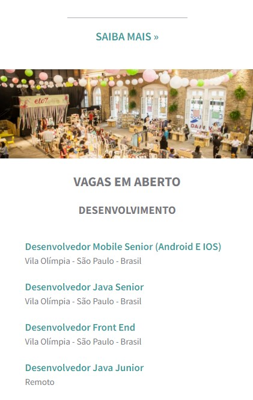

<h1 id="início">
  Desafio de frontend para a empresa Elo7.
</h1>

Desafio proposto pela empresa Elo7, onde devemos desenvolver uma landing page com um resumo sobre a Elo7, informações sobre como é trabalhar na empresa e o consumo de uma API para exibir vagas em aberto. 

## Índice

* [1. Sobre o projeto](#1-sobre-o-projeto)
* [2. Resultado do projeto](#2-resultado-do-projeto)
* [3. Guia de instalação](#3-guia-de-instalação)
* [4. Tecnologias utilizadas](#4-tecnologias-utilizadas)
* [5. Implementações Futuras](#5-implementações-futuras)
* [6. Autora do projeto](#6-autora-do-projeto)

## 1. Sobre o projeto

A proposta deste projeto foi desenvolver uma landing page que permitisse exibir informações sobre a empresa. Para a exibição das vagas que estão em aberto, foi disponibilizada uma API, onde tratei o response da requisição, exibindo ao usuário apenas as vagas ativas, e as que não possuem localização foram exibidas como remotas.

Para o planejamento do projeto, utilizei a ferramenta projects do github pra estruturar o board, com o template de Kanban automatizado, proporcionando melhor organização. Você pode [conferi-lo aqui](https://github.com/users/isisnoron/projects/2/views/1).

Principais objetivos: 

   - Seguir o layout conforme proposto e fazer a responsividade; 
  
   - Consumir a API disponibilizada e exibir os dados tratados;

   - Acessibilidade;
  
   - Implementação de testes;
  
  
 O _boilerplate_ foi estruturado de acordo com as funcionalidades do projeto e seus componentes.

 O projeto foi desenvolvido com **Angular e Typescript**, você pode conferir mais sobre o assunto na sessão [4. Tecnologias utilizadas](#4-tecnologias-utilizadas).

 ## 2. Resultado do projeto

 Seguindo fielmente o layout fornecido, criei os componentes conforme os tópicos necessários.
 Importante salientar que foi feita a implementação de recursos de **acessibilidade**.
 Confira abaixo como ficou a aplicação!

 

 

 O site também é responsivo.

 

 Pensando na **experiência do usuário**, foi criada uma página "em construção" para caso o usuário clique no link "Saiba mais", onde ele será redirecionado para uma página com uma mensagem de "Estamos trabalhando para melhor atendê-lo.", e com opção para voltar a página inicial proposta. 

No caso do usuário digitar na url uma rota que não existe, foi implementada uma página 404 informando que o caminho não foi encontrado, também com opção de voltar a página inicial.

 

Realizei os testes no serviço, nas páginas e nos componentes.

 

## 3. Guia de Instalação
Você também pode testar e manipular o projeto localmente, basta seguir os seguintes passos:

Para clonar o projeto, abra seu terminal, digite o seguinte comando abaixo e aperte enter:

      git clone https://github.com/isisnoron/elo7-desafio-frontend.git
  
Feito isso, ainda no terminal, entre na pasta clonada e digite o seguinte comando:

      npm install  
    

Agora vamos rodar a aplicação! Digite no terminal:
        
      npm start
      

Prontinho! Você já pode usar o projeto. 

Para conferir a cobertura de testes, digite no terminal:
        
      npm test
      

## 4. Tecnologias utilizadas

* [Angular](https://angular.io/)
* [Typescript](https://www.typescriptlang.org/)
* [Jasmine](https://jasmine.github.io/)
* [Karma](https://karma-runner.github.io/latest/index.html)
* [JavaScript](https://developer.mozilla.org/pt-BR/docs/Web/JavaScript)
* HTML 5
* CSS
* [Prettier](https://prettier.io/)
* [Eslint](https://eslint.org/)
* Git e GitHub
* [Visual Studio Code](https://code.visualstudio.com/)

Escolhi utilizar o framework Angular 13, devido minha afinidade pessoal. Por padrão, ele ja vem com Typescript, que fornece tipagem estática, classes e interfaces, além de outras características que ajudam a melhorar a qualidade do código.

Optei por utilizar ESlint e Prettier para garantir a qualidade do código e sua consistência, assegurando as boas práticas das regras estabelecidas.

Nas premissas do desafio, é solicitado que a requisição deve ser fetch ou axios. Porém, como optei por utilizar Angular, o framework tem seu próprio módulo nativo para requisições, o **HttpClient** que basicamente faz a mesma coisa, só que ao invés de retornar uma promise, ele retorna um observable. Além disso, acredito que a escolha do HttpClient é mais completa para o projeto, por ter sido criado para trabalhar com a arquitetura do Angular, e pelas seguintes razões: ele se integra perfeitamente com outros recursos do framework, como observables e gerenciamento de estado, tornando mais fácil criar aplicações de fácil manutenção. Além disso, o HttpClient é mais compatível com os navegadores, pois fornece suporte a navegadores antigos e atuais, enquanto o Fetch só é compatível com navegadores mais recentes. Ele também é mais seguro, pois fornece recursos como validação de conteúdo e suporte ao CORS, tornando mais fácil proteger o aplicativo a ameaças de segurança.
 
Para os testes, utilizei o framework Jasmine e o executor de testes Karma, que também são padrões do Angular.

  
## 5. Implementações Futuras
      
Em futuras implementações, para a melhoria e desempenho do projeto, desejo realizar os seguintes pontos:

  - Melhor performance da aplicação
  - Utilização de SASS para estilização.
  - Melhoria na questão de validações e tratamentos de erros.

## 6. Autora do projeto

👩‍💻 Projeto desenvolvido por:

  <table>
    <thead>
      <tr>
        <th align="center">Isis Ribeiro</th>
      </tr>
    </thead>
    <tbody>
      <tr>
        <td align="center">
          <a href="#">
             
          </a>
        </td>
      <tr>      
        <td align="center">
          
          
        </td>
       </tr>
    </tbody>
  </table>

  <a href="#início">
  ⬆ Voltar ao início
 </a>

